# ArchQ　

ArchQ is headless Arch Linux with high quality music server and player for audiophiles.

Powered by optimized realtime kernel() frequency works on 441/396.9/352.8 KHz.
Thus, you do not need to upsample your music files anymore, even SQ is better than them.
ArchQ includes the LMS, Roon(bridge), MPD(CD Play) and optimized Squeezelite & Airplay and CD ripper(abcde), and it's easy to install and configure.
If the cpu is more than 2 cores, LMS and squeezelite will work at isolated cpu.

Install step:
1. Download the [Arch Linux Install ISO](http://mirror.rackspace.com/archlinux/iso/latest/)

2. Flash ISO image to USB drive by [Etcher](https://www.balena.io/etcher/?).

3. Boot up with USB drive with UEFI mode, than typing as below. (Use 'ip addr' to check if conneted on the network or not.)
 
   `curl https://raw.githubusercontent.com/sam0402/ArchQ/main/install | bash`

4. After reboot, the monitor will not show any message only 'linux-Q352 ...'

5. Enter URL `http://name@hostname.local:9000` or `http://ip.address:9000` in browser to configure LMS.

   Enter URL `http://name@hostname.local:6660` or `http://ip.address:6660` in browser to configure RompЯ.

6. Use `ssh name@hostname.local` or `ssh name@ip.address` to login ArchQ system and configure. (Use [PuTTY](https://www.putty.org) for Windows)
   
   Enter command `config` for setting kernel version, partitions, NFS client, SMB/CIFS client, ethernet, squeezelite and Airplay.

7. Use command `sensors` to check the temperature of CPU, which is not too high.

Enter command `reboot` if need to.

Enjoy it!　
 
[ArchQ Chinese manual](http://www.stsd99.com/phpBB3/viewtopic.php?f=61&t=3210&sid=702a4898b30a89bc20ba1276940ef412) 

Supported Hardware: (Include Macbook or Mac mini Intel version)
 1. CPU: Intel & AMD (x86_64)
 2. Disk drive: SATA, USB, NVME >= 16GB
 3. Filesystem: F2FS(default), EXT4, XFS, HFS+(Apple), NTFS3, FATs, NFS, SMB/CIFS
 4. Ethernet: Intel e100, e1000, 82575/82576(IGB), I225-LM/I225-V (IGC), Realtek RTL8125/8129/8130/8139/8111/8168/8411
 5. USB Ethernet: Realtek RTL8152/8153, ASIX AX88179/178A
 6. Sound card: USB(DDC, DAC) & HDMI (Intel i915)

Stand-alone: Install
 1. LMS + Squeezelite
 2. Roon
 3. MPD (CD play, Multiroom, Httpd Stream)
 4. Airplay

Client-server:

 Server: Install Roon or LMS
 
 Player:
  1. Squeezelite
  3. Roonbridge
  4. Airplay
  5. Raspberry 4 or CM4 install with [pCP8-Q264ax.img.001](https://raw.githubusercontent.com/sam0402/pcp-44.1KHz/master/pCP8-Q264ax.img.7z.001),  [pCP8-Q264ax.img.002](https://raw.githubusercontent.com/sam0402/pcp-44.1KHz/master/pCP8-Q264ax.img.7z.002)
     
 HDMI output (Intel i915): Install and boot by Q352H

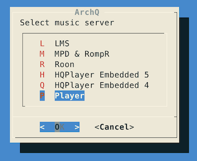
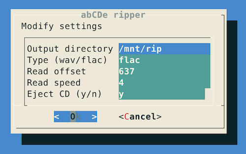
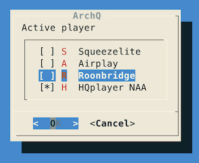
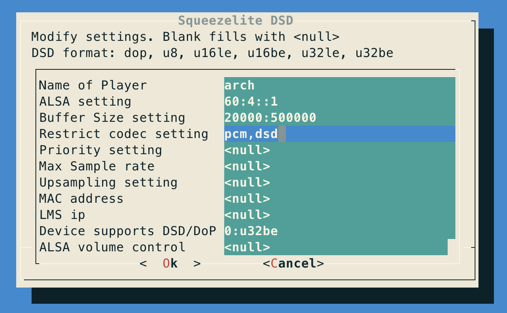

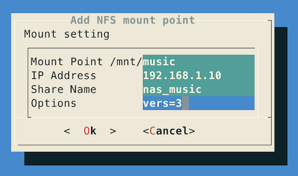
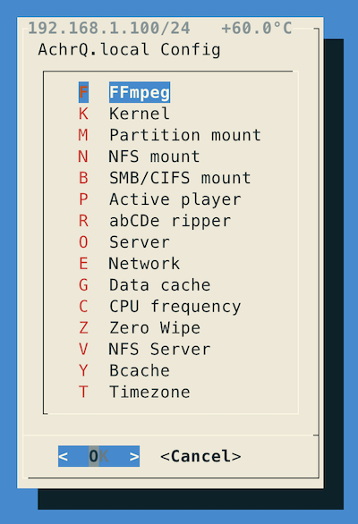
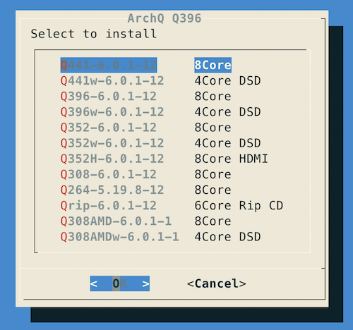
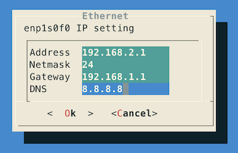
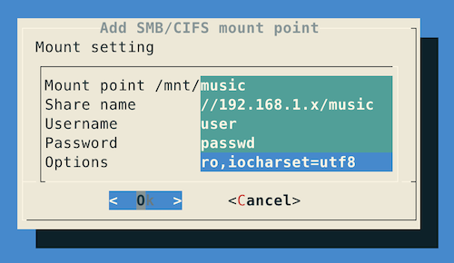
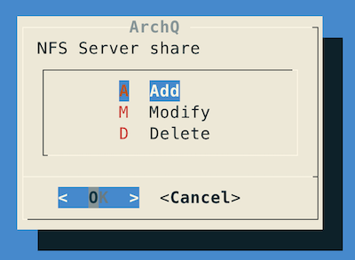
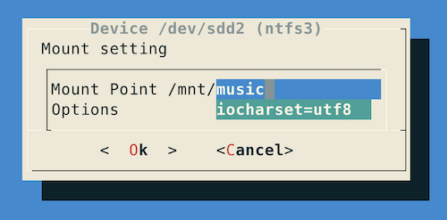
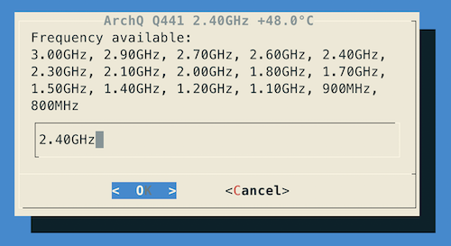
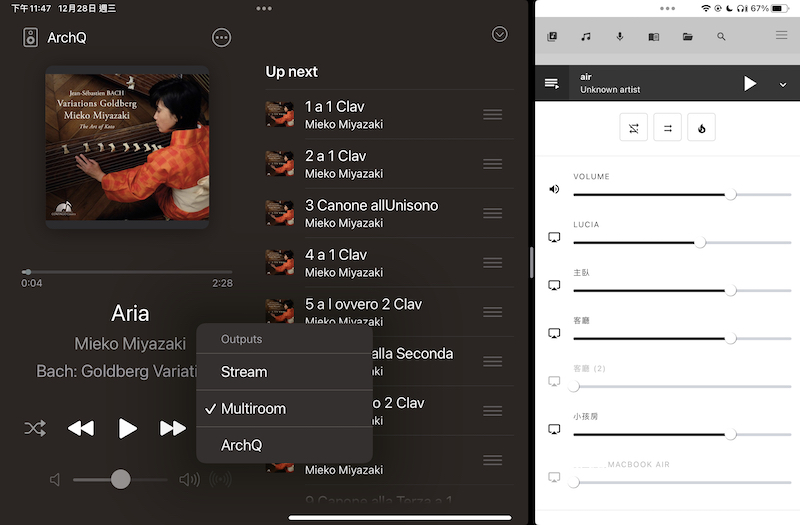
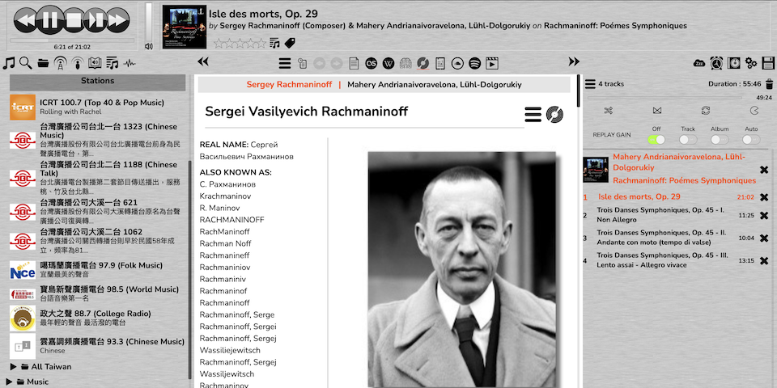
