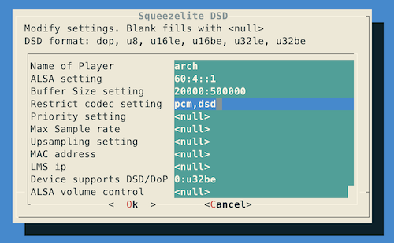

# ArchQ　

ArchQ headless linux is high quality music server and player for audiophiles.

Powered by optimized realtime kernel(5.16) frequency works on 352.8KHz.
Thus, you do not need to upsample your music files anymore, even SQ is better than them.
ArchQ includes the LMS, Roon(bridge), MPD servers & optimized Squeezelite, Airplay, and it's easy to install and configure.
If the cpu is more than 2 cores, LMS and squeezelite will work at isolated cpu.

Boot up with Arch Linux Install ISO (http://mirror.rackspace.com/archlinux/iso/latest/), than typing as below.
 
`curl -sL https://raw.githubusercontent.com/sam0402/ArchQ/main/install-arch.sh | bash`

After reboot, the monitor will not show any message only 'linux-Q352A ...'

Use `ssh name@host.local` or `ssh name@ip.address` to login ArchQ system and configure.

Use `sudo config.sh` command for setting kernel version, partitions, NFS client, ethernet and squeezelite.

Use `sensors` command to check the CPU temperature, which is not too high.

Enjoy it!　
 
Supported Hardware: (Include Macbook or Mac mini Intel version)
 1. CPU: Intel(12gen) & AMD 
 2. Disk drive: SATA, USB, NVME >= 16GB
 3. Filesystem: F2FS(default), EXT4, XFS, HFS+(Apple), NTFS3, FATs, NFS, CIFS/SMBFS
 4. Ethernet: Intel e100, e1000, 82575/82576(IGB), I225-LM/I225-V (IGC), Realtek RTL8129/8130/8139/8111/8168/8411
 5. USB Ethernet: Realtek RTL8152/8153, ASIX AX88179/178A
 6. Sound card: USB(DDC, DAC) & HDMI (Intel i915)

Stand-alone: Install
 1. LMS + Squeezelite
 2. Roon
 4. MPD
 5. Airplay

Client-server:

 Server: Install Roon or LMS
 
 Player:
  1. Squeezelite (Install and boot by Q352A or Q352AMD for PCM only)
  3. Roonbridge
  4. Airplay
  5. Raspberry 4 or CM4 install with pCP8-Q264_5.16.5 
     (https://github.com/sam0402/pcp-44.1KHz/blob/master/pCP8-Q264_5.16.5.img.7z.001)
     (https://github.com/sam0402/pcp-44.1KHz/blob/master/pCP8-Q264_5.16.5.img.7z.002)
 HDMI output (Intel i915): Install and boot by Q352h
 
http://www.stsd99.com/phpBB3/viewtopic.php?f=61&t=3129&sid=3e3eeea96d483cf9b63b8200b949685e&p=20583#p20583

